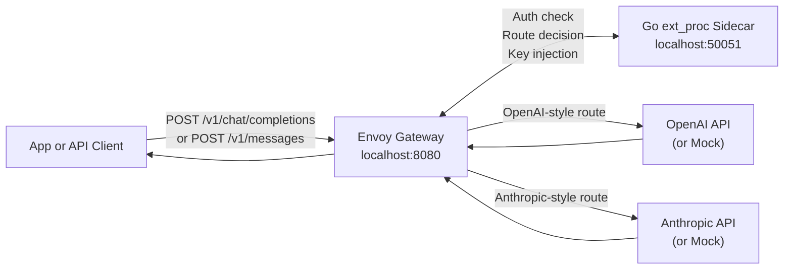
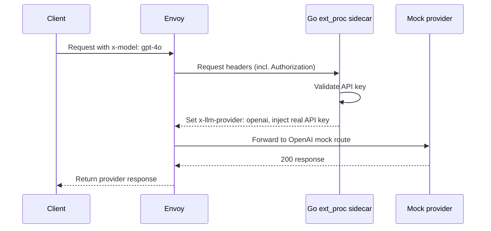
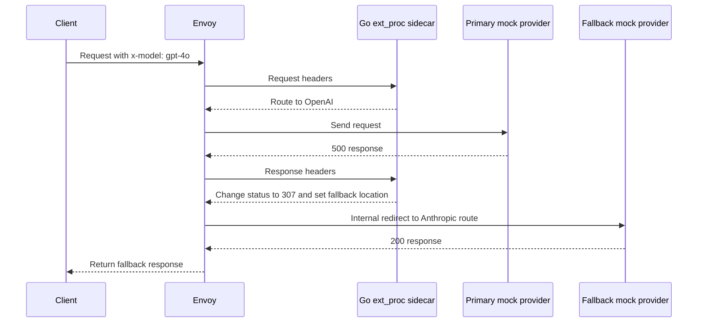

<div align="center">

<h1>llm-gateway</h1>

<p><strong>A production-ready LLM API gateway that routes requests to the right provider, falls back transparently on failure, and enforces authentication and rate limits.</strong></p>

<p>
  
  
  
  
  
  
</p>

<p>
  <a href="#about">About</a> |
  <a href="#the-short-version">Short Version</a> |
  <a href="#how-it-works">How It Works</a> |
  <a href="#deep-dive">Deep Dive</a> |
  <a href="#quick-start">Quick Start</a> |
  <a href="#production-deployment">Production</a> |
  <a href="#testing">Testing</a>
</p>

</div>

---

## About

`llm-gateway` is a production-grade API gateway for LLM traffic.

You send one request to the gateway. The gateway looks at the model you asked for, authenticates your API key, decides which provider should handle it, sends the request there, and can fall back to the other provider if the first one fails — all transparently.

The gateway enforces rate limiting (100 req/min), translates request schemas bidirectionally (OpenAI $\leftrightarrow$ Anthropic), tracks real-time usage costs to enforce virtual key budgets, injects server-side provider credentials, and produces structured JSON logs for every routing decision.

## The Short Version

Think of this project as a smart front door for LLM APIs.

| If you are... | Read this as... |
| --- | --- |
| New to gateways | A single API entrypoint that sends each request to the right backend. |
| Building an AI product | A pattern for provider fallback, model routing, auth, rate limiting, and failure testing. |
| An infrastructure engineer | Envoy with a Go `ext_proc` sidecar that mutates headers and uses internal redirects for fallback. |
| Testing reliability | A controlled lab where upstreams can return `500`, delay, drop connections, or send malformed JSON. |

### What problem does it solve?

LLM apps often talk to more than one provider. That creates practical questions:

| Question | What this gateway demonstrates |
| --- | --- |
| Which provider should handle this model? | Route by `x-model`, endpoint path, and fallback state. |
| What happens if the primary provider fails? | Convert `5xx` responses into a controlled fallback request. |
| How do we avoid retry loops? | Mark fallback requests and allow only one internal redirect. |
| How do we protect our API keys? | Client uses a gateway key; real provider keys stay server-side. |
| How do we prevent abuse? | Envoy enforces 100 req/min per client with `429` responses. |
| How can we test failure behavior locally? | Use a mock upstream with fault-injection headers. |
| How can we prove it works? | Run unit tests and 48 Playwright E2E tests against the full stack. |

## System At A Glance



The gateway has three moving parts:

| Part | Plain-English role | Technical role |
| --- | --- | --- |
| Envoy | The traffic router + rate limiter | HTTP proxy, route matcher, `ext_proc` caller, internal redirect executor, local rate limiter |
| Go sidecar | The decision maker + auth gate | gRPC external processor that authenticates clients, injects provider keys, reads/mutates headers, triggers fallback |
| Mock server | The fake provider lab | Local OpenAI/Anthropic simulator with fault injection |

## How It Works

### 1. Normal request flow



The sidecar does not generate LLM answers. It authenticates, routes, and injects credentials.

### 2. Fallback request flow



From the client's point of view, this still feels like one request. Envoy handles the fallback internally.

### 3. Provider decision table

| Request signal | Provider selected |
| --- | --- |
| `x-model: gpt-4o` | OpenAI |
| `x-model: gpt-4-turbo` | OpenAI |
| `x-model: o1-mini` | OpenAI |
| `x-model: claude-3-5-sonnet` | Anthropic |
| `POST /v1/chat/completions` with no known model | OpenAI |
| `POST /v1/messages` with no known model | Anthropic |
| `/v1/messages?fallback=true` | Anthropic |
| `/v1/chat/completions?fallback=true` | OpenAI |

### 4. Failure behavior

| Upstream result | Gateway behavior |
| --- | --- |
| `2xx` | Return the response normally. |
| `4xx` | Return the response normally. Client or request problem, not a provider outage. |
| Primary `5xx` | Try the fallback provider through an Envoy internal redirect. |
| Fallback `5xx` | Return the failure. Do not retry forever. |

## Deep Dive

This section is for people who want to understand the internals.

### Why Envoy?

Envoy is doing the heavy traffic work:

- Listening on `localhost:8080`
- Matching public API paths like `/v1/chat/completions` and `/v1/messages`
- Calling the external processing sidecar before routing
- Re-checking routes after the sidecar adds headers
- Rewriting paths to the mock upstream routes
- Performing one internal redirect when fallback is needed
- Enforcing per-client rate limits (100 req/min token bucket)

The key point: Envoy stays the data plane. The Go sidecar makes small decisions, but Envoy still owns routing.

### Why a Go `ext_proc` sidecar?

Envoy's External Processing API lets a separate service inspect request and response metadata over gRPC.

In this project, the sidecar watches two phases:

| Phase | What the sidecar reads | What it changes |
| --- | --- | --- |
| Request headers | `:path`, `x-model`, `authorization`, fallback markers | Validates API key; sets `x-llm-provider`; injects real provider key; adds `x-request-id` |
| Response headers | `:status` | Turns primary `5xx` into `307` plus `location` for fallback |

The sidecar lives in `pkg/extproc/server.go`.

### Authentication & Spend Budgets

```text
Client → Gateway (client key) → Sidecar validates Auth & Budget → Injects Upstream Key → Upstream
```

- **Authentication**: Clients send `Authorization: Bearer <gateway-key>`. The sidecar validates this against the virtual key vault (populated via the `GATEWAY_API_KEYS` environment variable).
- **Key Injection**: The real provider API keys (`OPENAI_API_KEY`, `ANTHROPIC_API_KEY`) stay securely on the server and are injected dynamically by the sidecar.
- **Budget Enforcement**: The sidecar buffers upstream response bodies, parses the token usage data, and calculates request costs in a thread-safe way using a model-specific pricing map. If a client's total spend exceeds their monthly budget (e.g. $100), future requests are blocked at the proxy with a `429 Too Many Requests` (custom budget exceeded error).

Set `GATEWAY_API_KEYS` to empty to disable auth/budget checking (dev mode).

### Why clear Envoy's route cache?

Envoy chooses a route early. But this gateway needs the sidecar to add `x-llm-provider` first.

So after the sidecar mutates request headers, it asks Envoy to clear the route cache. Envoy then evaluates routes again, now with the new provider header available.

Without that step, Envoy could keep using the first route it picked before the sidecar made its decision.

### Bidirectional Schema Translation

Different LLM providers expect different request schemas. For example, OpenAI expects `messages` in a flat array, while Anthropic has a top-level `system` prompt parameter and a specific `messages` structure.

The gateway performs schema translation on-the-fly:
- **OpenAI to Anthropic**: If a client sends an OpenAI-formatted request (`/v1/chat/completions`) but it routes/falls back to Anthropic, the sidecar converts it. System roles are extracted and combined into Anthropic's top-level `system` parameter, and max tokens/temperatures are mapped dynamically.
- **Anthropic to OpenAI**: If an Anthropic request (`/v1/messages`) routes/falls back to OpenAI, the sidecar converts the system parameter and messages back to OpenAI format.
- **Double-Translation Protection**: The sidecar hoists request state and tracks the original route. If the incoming format matches the destination provider (e.g. a native Anthropic request routed directly to Anthropic), translation is skipped entirely to prevent payload corruption.

### Why use a `307` for fallback?

The sidecar does not directly call the fallback provider. Instead, it changes a failed primary response into:

```text
:status: 307
location: /v1/messages?fallback=true
```

Envoy sees that `307`, treats it as an internal redirect, and sends the request to the fallback route.

This keeps fallback inside the proxy layer instead of making the sidecar become a second HTTP client.

### How retry loops are avoided

Fallback requests include a marker:

```text
fallback=true
```

The sidecar checks for that marker. If a request is already a fallback request and the fallback provider also fails, the sidecar does not create another redirect.

That keeps one bad upstream from turning into an infinite request loop.

## Quick Start

### Prerequisites

- Docker or Docker Desktop with Compose support
- Node.js 20+ and npm
- Go 1.22+ if you want to run Go unit tests directly on your machine

### Run the local stack

```bash
# Copy and configure environment
cp .env.example .env
# Edit .env with your settings (optional for dev mode)

# Start everything
npm ci
docker compose up --build -d
npm run test:e2e
docker compose down -v
```

If your environment still uses the older Compose binary, use `docker-compose` instead of `docker compose`.

### Try the OpenAI-style route

```bash
curl -i http://localhost:8080/v1/chat/completions \
  -H "content-type: application/json" \
  -H "authorization: Bearer local-test-key" \
  -H "x-model: gpt-4o" \
  -d '{"model":"gpt-4o","messages":[{"role":"user","content":"hello"}]}'
```

### Try the Anthropic-style route

```bash
curl -i http://localhost:8080/v1/messages \
  -H "content-type: application/json" \
  -H "authorization: Bearer local-test-key" \
  -H "x-model: claude-3-5-sonnet" \
  -d '{"model":"claude-3-5-sonnet","messages":[{"role":"user","content":"hello"}]}'
```

### Force fallback

```bash
curl -i http://localhost:8080/v1/chat/completions \
  -H "content-type: application/json" \
  -H "authorization: Bearer local-test-key" \
  -H "x-model: gpt-4o" \
  -H "x-inject-openai-status: 500" \
  -d '{"model":"gpt-4o","messages":[{"role":"user","content":"force fallback"}]}'
```

## Production Deployment

### Environment variables

| Variable | Required | Description |
| --- | --- | --- |
| `GATEWAY_API_KEYS` | Recommended | Comma-separated client API keys. Empty = auth disabled. |
| `OPENAI_API_KEY` | For real traffic | Injected into upstream OpenAI requests. |
| `ANTHROPIC_API_KEY` | For real traffic | Injected into upstream Anthropic requests. |

### Switching from mocks to real providers

Replace the `openai` and `anthropic` cluster endpoints in `envoy/envoy.yaml`:

```yaml
# Replace mock-server with real upstream
- name: openai
  type: LOGICAL_DNS
  load_assignment:
    cluster_name: openai
    endpoints:
    - lb_endpoints:
      - endpoint:
          address:
            socket_address:
              address: api.openai.com
              port_value: 443
  transport_socket:
    name: envoy.transport_sockets.tls
    typed_config:
      "@type": type.googleapis.com/envoy.extensions.transport_sockets.tls.v3.UpstreamTlsContext
      sni: api.openai.com
```

### Rate limiting

Default: 100 requests per minute per client. Adjust in `envoy/envoy.yaml`:

```yaml
token_bucket:
  max_tokens: 100       # burst capacity
  tokens_per_fill: 100  # tokens added per interval
  fill_interval: 60s    # interval
```

Clients exceeding the limit receive `429 Too Many Requests` with a `Retry-After: 60` header.

### Structured logging

The sidecar outputs JSON-structured logs for every request:

```json
{"time":"2026-01-01T00:00:00Z","level":"INFO","msg":"request routed","request_id":"abc-123","model":"gpt-4o","provider":"openai","fallback":false,"path":"/v1/chat/completions"}
{"time":"2026-01-01T00:00:00Z","level":"INFO","msg":"response completed","request_id":"abc-123","provider":"openai","status_code":200,"fallback":false,"latency_ms":42}
```

### Health checks

All services expose health endpoints checked by Docker Compose:

| Service | Check | Interval |
| --- | --- | --- |
| Envoy | `GET localhost:8001/ready` | 5s |
| Sidecar | TCP `:50051` | 5s |
| Mock server | `GET localhost:8081/health` | 5s |

Envoy waits for both sidecar and mock-server to be healthy before starting.

## Failure Lab

Use these headers to make the mock providers misbehave on purpose.

| Header | What it does |
| --- | --- |
| `x-inject-error: true` | Forces a generic `500`. |
| `x-inject-openai-status: 500` | Forces the OpenAI mock to return that status. |
| `x-inject-anthropic-status: 503` | Forces the Anthropic mock to return that status. |
| `x-inject-status: 429` | Forces a generic status from the active provider. |
| `x-inject-delay: 5000` | Waits before responding. |
| `x-inject-openai-delay-ms: 5000` | Delays only OpenAI mock handling. |
| `x-inject-anthropic-delay-ms: 5000` | Delays only Anthropic mock handling. |
| `x-inject-connection-drop: true` | Drops the upstream TCP connection. |
| `x-inject-corrupt-body: true` | Returns malformed JSON. |

## Testing

### Go unit tests

```bash
go test ./...
```

These tests cover the mock handlers and the sidecar's routing/fallback decisions.

### Playwright E2E tests

```bash
npm run test:e2e
npm run test:e2e:tier1
npm run test:e2e:tier2
npm run test:e2e:tier3
npm run test:e2e:tier4
```

| Tier | What it checks | Cases |
| --- | --- | --- |
| Tier 1 | Normal model routing | 18 |
| Tier 2 | Missing headers, bad inputs, upstream failures | 18 |
| Tier 3 | Combined routing and fallback scenarios | 5 |
| Tier 4 | Heavier real-world workload patterns | 7 |

By default, Playwright targets `http://localhost:8080`. Override it with:

```bash
GATEWAY_URL=http://localhost:8080 npm run test:e2e
```

## Repository Layout

```text
.
|-- .github/workflows/  # CI pipeline (Go tests + Playwright E2E)
|-- cmd/
|   |-- mock-server/    # Local OpenAI/Anthropic mock HTTP server
|   `-- sidecar/        # gRPC ext_proc sidecar entrypoint
|-- docker/             # Multi-stage service Dockerfiles
|-- envoy/
|   `-- envoy.yaml      # Envoy routes, clusters, filters, rate limits
|-- pkg/
|   `-- extproc/        # External processing: auth, routing, logging
|-- tests/
|   `-- e2e/            # Playwright API tests and gateway client helper
|-- .env.example        # Environment variable template
|-- docker-compose.yaml # Local three-service stack with health checks
|-- go.mod              # Go module definition
|-- package.json        # Playwright scripts
`-- LICENSE             # MIT License
```

## Ports

| Port | Service | Purpose |
| --- | --- | --- |
| `8080` | Envoy | Public gateway entrypoint |
| `8001` | Envoy admin | Envoy diagnostics and admin API |
| `50051` | Go sidecar | gRPC `ext_proc` service |
| `8081` | Mock server | Local OpenAI/Anthropic-style upstreams |

## Current Status

| Milestone | Status |
| --- | --- |
| E2E testing (48 tests) | ✅ Done |
| Mock upstream server | ✅ Done |
| Go `ext_proc` sidecar | ✅ Done |
| Envoy routing configuration | ✅ Done |
| Authentication & key management | ✅ Done |
| Bidirectional schema translation | ✅ Done |
| Spend tracking & budgets | ✅ Done |
| Rate limiting (100 req/min) | ✅ Done |
| Structured JSON logging | ✅ Done |
| Health checks | ✅ Done |
| CI pipeline (GitHub Actions) | ✅ Done |
| Local Docker integration | ✅ Done |

## License

[MIT](LICENSE)
