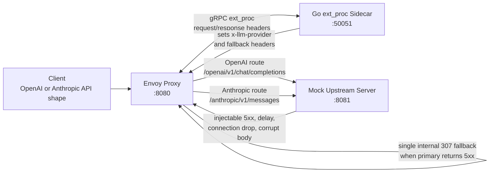

<div align="center">

<h1>llm-gateway</h1>

<p><strong>Envoy-powered LLM traffic gateway with dynamic provider routing, transparent fallback, and an end-to-end local test rig.</strong></p>

<p>
  
  
  
  
  
</p>

<p>
  <a href="#about">About</a> .
  <a href="#architecture">Architecture</a> .
  <a href="#quick-start">Quick Start</a> .
  <a href="#routing-and-fallback">Routing</a> .
  <a href="#testing">Testing</a> .
  <a href="#tags">Tags</a>
</p>

</div>

---

## About

`llm-gateway` is a local-first reference gateway for routing LLM API traffic across OpenAI-style and Anthropic-style interfaces. Envoy acts as the data plane, while a Go `ext_proc` sidecar inspects request headers, sets routing metadata, and turns upstream `5xx` failures into controlled internal fallback redirects.

The repository also includes a mock upstream server and a Playwright API test suite, so routing and failure behavior can be exercised without real provider credentials or external API calls.

## Why It Exists

LLM applications increasingly need provider portability, deterministic fallback behavior, and testable edge handling. This project demonstrates that shape with infrastructure components that are close to production patterns:

| Capability | What this project provides |
| --- | --- |
| Provider selection | Routes by `x-model`, endpoint path, and fallback state. |
| Fallback control | Converts primary `5xx` responses into Envoy internal redirects. |
| Loop protection | Marks fallback requests so failed fallback traffic does not redirect forever. |
| Local determinism | Uses a mock OpenAI/Anthropic upstream with injectable failures. |
| Test coverage | Splits E2E tests into happy path, boundary, cross-feature, and workload tiers. |

## Architecture



### Components

| Component | Path | Responsibility |
| --- | --- | --- |
| Envoy proxy | `envoy/envoy.yaml` | HTTP entrypoint, provider routes, cluster definitions, `ext_proc` filter, internal redirect policy. |
| Go sidecar | `pkg/extproc/server.go`, `cmd/sidecar/main.go` | Envoy External Processing server that mutates headers and triggers fallback redirects. |
| Mock upstream | `cmd/mock-server/main.go` | Local OpenAI and Anthropic response simulator with failure injection controls. |
| Docker stack | `docker-compose.yaml`, `docker/*.Dockerfile` | Runs Envoy, sidecar, and mock upstream on a shared bridge network. |
| E2E tests | `tests/e2e/` | Playwright API tests against the gateway entrypoint. |

## Quick Start

### Prerequisites

- Docker or Docker Desktop with Compose support
- Node.js 20+ and npm
- Go 1.22+ if running Go unit tests directly on the host

### Run the full local stack

```bash
npm ci
docker compose up --build -d
npm run test:e2e
docker compose down -v
```

If your environment still uses the standalone Compose binary, replace `docker compose` with `docker-compose`.

### Smoke test the OpenAI-compatible route

```bash
curl -i http://localhost:8080/v1/chat/completions \
  -H "content-type: application/json" \
  -H "authorization: Bearer local-test-key" \
  -H "x-model: gpt-4o" \
  -d '{"model":"gpt-4o","messages":[{"role":"user","content":"hello"}]}'
```

### Smoke test the Anthropic-compatible route

```bash
curl -i http://localhost:8080/v1/messages \
  -H "content-type: application/json" \
  -H "authorization: Bearer local-test-key" \
  -H "x-model: claude-3-5-sonnet" \
  -d '{"model":"claude-3-5-sonnet","messages":[{"role":"user","content":"hello"}]}'
```

### Force primary-provider fallback

```bash
curl -i http://localhost:8080/v1/chat/completions \
  -H "content-type: application/json" \
  -H "authorization: Bearer local-test-key" \
  -H "x-model: gpt-4o" \
  -H "x-inject-openai-status: 500" \
  -d '{"model":"gpt-4o","messages":[{"role":"user","content":"force fallback"}]}'
```

All upstream responses are local mocks. No real OpenAI or Anthropic request is made.

## Routing And Fallback

### Provider selection

| Input | Provider decision |
| --- | --- |
| `x-model` starts with `gpt` | OpenAI mock route |
| `x-model` starts with `o1` | OpenAI mock route |
| `x-model` starts with `claude` | Anthropic mock route |
| Missing or unknown model on `/v1/chat/completions` | OpenAI mock route |
| Missing or unknown model on `/v1/messages` | Anthropic mock route |
| Fallback request to `/v1/messages?fallback=true` | Anthropic mock route |
| Fallback request to `/v1/chat/completions?fallback=true` | OpenAI mock route |

### Failure behavior

| Upstream result | Gateway behavior |
| --- | --- |
| `2xx` | Response passes through. |
| `4xx` | Response passes through by default. |
| Primary `5xx` | Sidecar mutates response to `307` with a fallback `location`; Envoy handles it as an internal redirect. |
| Fallback `5xx` | Response is returned without another redirect, preventing loops. |

### Failure injection headers

| Header | Effect |
| --- | --- |
| `x-inject-error: true` | Forces a generic `500` from the active mock provider. |
| `x-inject-openai-status: 500` | Forces a specific OpenAI mock status. |
| `x-inject-anthropic-status: 503` | Forces a specific Anthropic mock status. |
| `x-inject-status: 429` | Forces a generic mock status. |
| `x-inject-delay: 5000` | Sleeps before responding. |
| `x-inject-openai-delay-ms: 5000` | Delays only OpenAI mock handling. |
| `x-inject-anthropic-delay-ms: 5000` | Delays only Anthropic mock handling. |
| `x-inject-connection-drop: true` | Drops the upstream TCP connection. |
| `x-inject-corrupt-body: true` | Returns malformed JSON. |

## Testing

### Go unit tests

```bash
go test ./...
```

The unit suite covers mock upstream handlers and `ext_proc` routing/fallback decisions.

### Playwright E2E tests

```bash
npm run test:e2e
npm run test:e2e:tier1
npm run test:e2e:tier2
npm run test:e2e:tier3
npm run test:e2e:tier4
```

| Tier | Focus | Coverage |
| --- | --- | --- |
| Tier 1 | Happy path model routing | 18 cases |
| Tier 2 | Boundary and corner cases | 18 cases |
| Tier 3 | Cross-feature fallback combinations | 5 cases |
| Tier 4 | Real-world workload simulations | 7 workloads |

Playwright targets `http://localhost:8080` by default. Override it with:

```bash
GATEWAY_URL=http://localhost:8080 npm run test:e2e
```

## Repository Layout

```text
.
|-- cmd/
|   |-- mock-server/        # Local OpenAI/Anthropic mock HTTP server
|   `-- sidecar/            # gRPC ext_proc sidecar entrypoint
|-- docker/                 # Multi-stage service Dockerfiles
|-- envoy/
|   `-- envoy.yaml          # Envoy routes, clusters, filters, redirects
|-- pkg/
|   `-- extproc/            # External processing server implementation
|-- tests/
|   `-- e2e/                # Playwright API tests and gateway client helper
|-- docker-compose.yaml     # Local three-service stack
|-- go.mod                  # Go module definition
|-- package.json            # Playwright runner scripts
|-- PROJECT.md              # Project architecture and milestone notes
|-- TEST_INFRA.md           # E2E infrastructure details
`-- TEST_READY.md           # Test readiness checklist
```

## Operational Notes

| Port | Service |
| --- | --- |
| `8080` | Envoy client entrypoint |
| `8001` | Envoy admin interface |
| `50051` | Go `ext_proc` sidecar gRPC server |
| `8081` | Mock upstream HTTP server |

- The mock server does not validate real API keys.
- Authorization headers are forwarded for testing but not authenticated.
- The fallback mechanism is intentionally scoped to `5xx` responses.
- Docker must be running before the Compose stack or E2E tests can validate the full gateway path.

## Roadmap

| Milestone | Status |
| --- | --- |
| E2E testing track | Done |
| Mock upstream server | Done |
| Go `ext_proc` sidecar | Done |
| Envoy routing configuration | Done |
| Local Docker integration | Done |
| End-to-end validation | In progress |
| Adversarial hardening | Planned |

## Tags

Recommended GitHub repository topics:

`envoy` `go` `grpc` `ext-proc` `llm` `llm-gateway` `api-gateway` `model-routing` `fallback` `playwright` `docker-compose` `openai` `anthropic`

## License

No license file is currently included. Add a license before distributing, packaging, or accepting external reuse.
